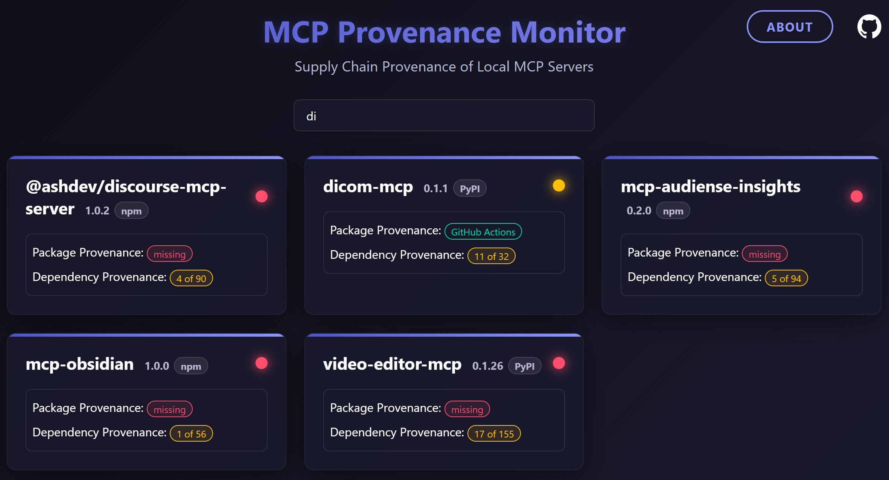
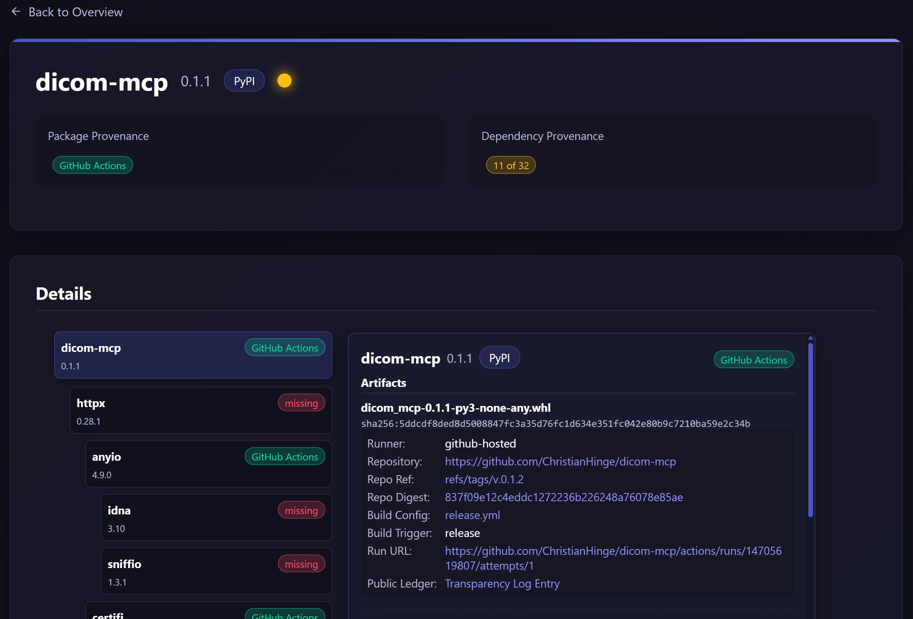

# MCP Provenance Monitor

👉 **[MCP Provenance Monitor Dashboard](https://letmaik.github.io/mcp-provenance-monitor)**  

A web dashboard for monitoring the software supply chain provenance of local MCP (Model Context Protocol) server packages.

[](https://letmaik.github.io/mcp-provenance-monitor)

[](https://letmaik.github.io/mcp-provenance-monitor)

## FAQ

**Why is MCP server xyz missing?**
- Currently, only servers published on [npm](https://www.npmjs.com/) or [PyPI](https://pypi.org/) are supported.
- Server data is sourced from the MCP registry at [https://github.com/modelcontextprotocol/registry](https://github.com/modelcontextprotocol/registry), which is still under development and not updated regularly. Manual additions are not supported yet.

**How can I add provenance to my MCP server?**
- For NPM packages, see [Generating provenance statements](https://docs.github.com/en/actions/security-guides/supply-chain-security#generating-provenance-statements).
- For PyPI packages, see [Producing attestations](https://docs.pypi.org/trusted-publishers/attestations/).

**How can I add provenance to dependencies?**
- Help improve the ecosystem by contributing to dependency packages: ensure they are built in CI and publish provenance. You can also consider submitting a pull request to those projects.

**I just released a new version with provenance, but it still says provenance is missing. Why?**
- Data is refreshed daily. If you just published a new version, please allow up to one day for the update to appear.

**Do MCP clients check provenance?**
- Not yet. For updates, see [this issue](https://github.com/modelcontextprotocol/modelcontextprotocol/issues/526).

## Development

```sh
pip install -r requirements.txt
python -m collector.main --dev
python -m http.server -d web
```

## License

See the [LICENSE](LICENSE) file for details.
